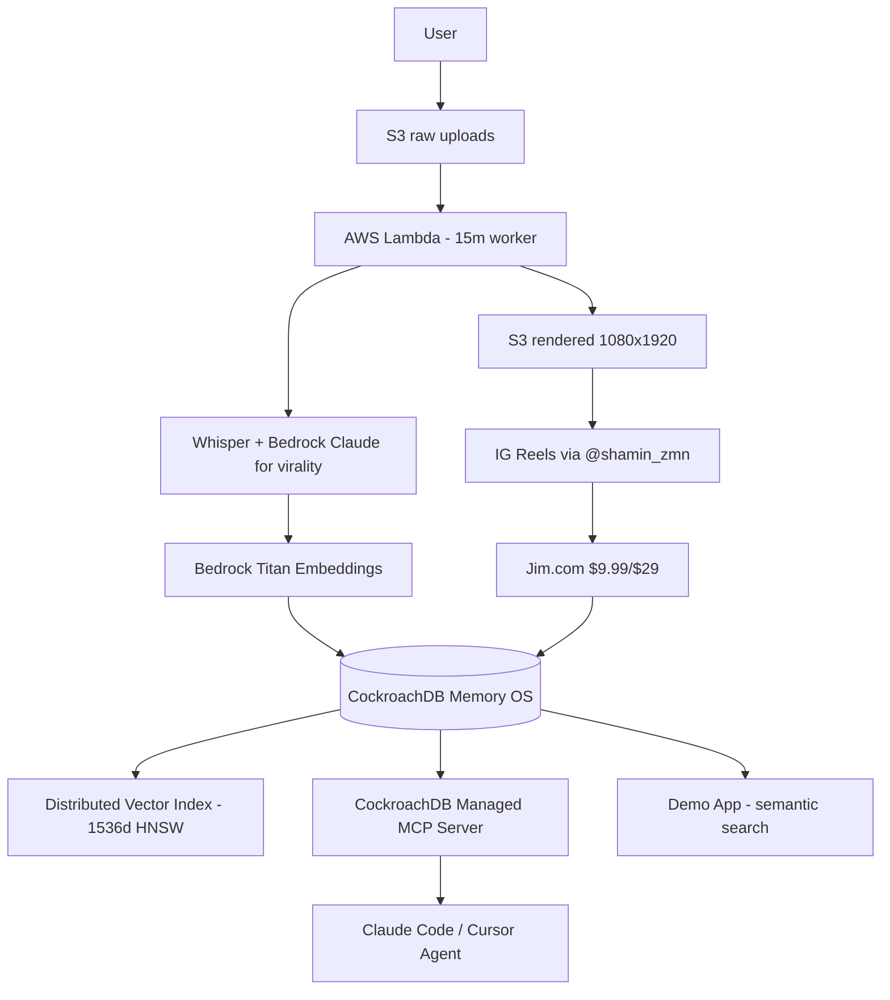

# Clip Studio Memory OS — CockroachDB × AWS Hackathon

**Agents that think. Agents that act. Agents that remember — reliably, globally, at scale.**

> Founder-led entry by @shamin_zmn — Queens Village, NYC. Turns 47 rendered 1080x1920 h264+AAC reels into persistent agentic memory.

[]() []() []()

## The Problem

Video clipping agents forget:
- Local SQLite dies on region failover
- No semantic search across thousands of 30-sec moments
- Clients re-upload same long-form, agent re-does work
- Payment + approval state lost

Current pipeline: 47 MP4s queued, 2 posted, $0 MRR. Needs memory that never goes down.

## The Solution: Memory OS

Store *everything* in CockroachDB as system of record:

1. **Ingest** long-form → S3 raw
2. **Lambda** transcribes / embeds (Bedrock Titan embeddings)
3. **Vector Index** stores clip embedding + transcript
4. **Agent** queries `SELECT * FROM clips ORDER BY embedding <-> $query LIMIT 5` — instant semantic recall
5. **MCP Server** lets Claude/Cursor directly read memory
6. **ccloud CLI** provisions & monitors cluster agentically

## Architecture



## CockroachDB Tools Used (≥2 required)

### 1. Distributed Vector Indexing
Schema: `embedding VECTOR(1536)` with HNSW inverted index. Query: `SELECT id, transcript, virality_score FROM clips ORDER BY embedding <-> $1 LIMIT 10`
- No separate Pinecone/Qdrant, consistency with operational data
- Fast semantic search: "founder talking about churn"

### 2. Managed MCP Server
Endpoint: `https://cockroachlabs.cloud/mcp`
Config: `src/mcp/config.json`
- Claude Code directly queries: "Show me top viral moments last week not approved"
- Read-only by default, audit logged

### 3. ccloud CLI (Agent-Ready)
Script: `src/ccloud/setup.sh`
- `ccloud cluster create clip-studio-mem --cloud aws --region us-east-1`
- `ccloud sql -c clip-studio-mem -d memory --file schema.sql`
- JSON output for agent monitoring

### 4. Agent Skills Repo (Open Source)
We import onboarding, query optimization, observability skills: `src/skills/README.md`

## AWS Services Used (≥1 required)

- **S3**: Raw long-form + rendered 1080x1920 reels (Sound ON -40.6 LUFS PASS)
- **Lambda**: Serverless 15m worker (ingest → transcribe → embed → store)
- **Bedrock**: 
  - Titan Embeddings v2 for vector
  - Claude 3.5 Sonnet for viral hook scoring + caption variants
- **ECS** (optional): Demo app hosting

## Quickstart

```bash
# 1. Provision CockroachDB
./src/ccloud/setup.sh

# 2. Run schema
ccloud sql --cluster clip-studio-mem --file src/schema.sql

# 3. Configure MCP in Claude Code
cp src/mcp/config.json ~/.claude/mcp.json

# 4. Deploy AWS
sam deploy --template-file infra/aws.yaml --capabilities CAPABILITY_IAM

# 5. Run agent locally
bun src/agent/clipAgent.ts --ingest demo/longform.mp4
```

## Demo Flow (3 min video)

0:00 Upload long-form to S3
0:20 Lambda auto-detects → transcription
0:40 Vector search: "show moment about pricing"
1:00 MCP: Claude queries memory directly
1:30 Approve → IG post with @shamin_zmn + Jim.com UTM
2:00 Checkout → $9.99 recorded in CockroachDB
2:30 Architecture + CockroachDB console showing vector index at work

Demo clip asset: `~/workspace/your_files/clip-studio-reels-keep-posting/cs-39-with-audio.mp4` (254KB, 1080x1920, PASS)

## Submission Checklist

- [x] Public repo + MIT license
- [x] README with tools identification
- [ ] Demo app URL (deploy space)
- [ ] 3-min YouTube video showing memory layer
- [ ] Architecture diagram
- Deadline: Aug 18 2026 5pm ET [rules](https://cockroachdb-ai.devpost.com/rules)

## Founder Funnel

CTA: https://pay.jim.com/jim_shaminuzzaman-bhuiya/Ri0x-CMuC2cWl6Y-9.99 (founder $9.99/mo)
$29 base product: /29
IG: @shamin_zmn

## License

MIT — See LICENSE
